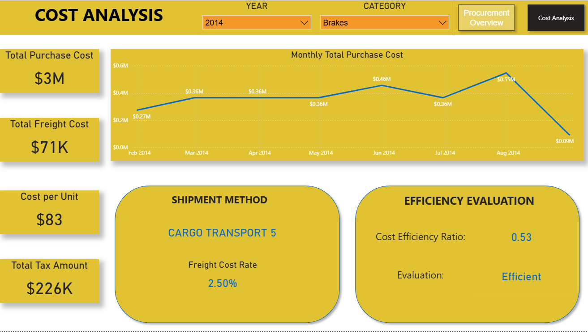
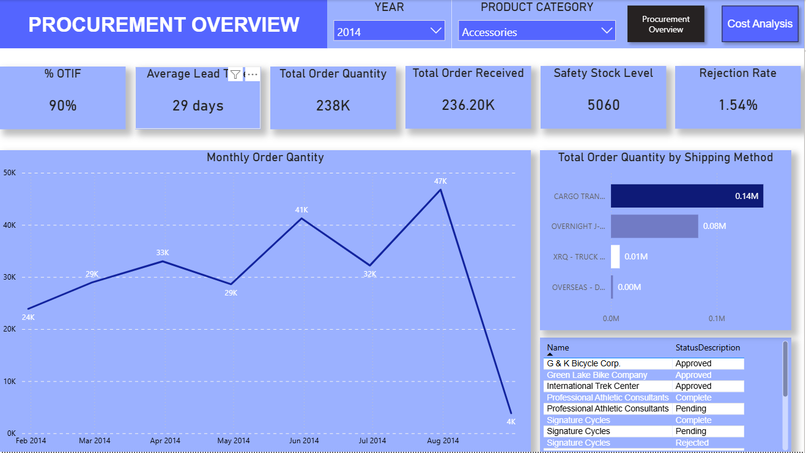

# 🚴 AdventureWorks Procurement & Cost Efficiency Dashboard

## 🌟 Project Overview
This project delivers a **Business Intelligence (BI) dashboard** built in **Microsoft Power BI**, using the AdventureWorks sample database as its data source.  

The dashboard is designed to provide **operational visibility** and **cost optimization insights** for the AdventureWorks procurement department. It consists of two complementary views:
- **Cost Analysis** – Focused on purchase costs, freight expenses, and cost efficiency evaluation.  
- **Procurement Overview** – Focused on supplier performance, order fulfillment, and lead times.  

Together, these dashboards enable leadership to make informed, data-driven decisions in procurement and supply chain operations.

---

## 🎯 Business Objectives
The project addresses two fundamental business questions for procurement leaders:

1. **How can we identify cost-saving opportunities?**  
   - Break down the primary cost drivers (purchase, freight, and taxes).  
   - Evaluate shipment methods and freight cost rates to highlight optimization potential.  
   - Monitor cost efficiency ratio to ensure procurement activities remain lean.

2. **Are our suppliers reliable and meeting expectations?**  
   - Track on-time and in-full delivery performance (**% OTIF**).  
   - Measure and monitor **average lead time** to ensure timeliness.  
   - Evaluate rejection rates and safety stock levels to safeguard supply continuity.

---

## 📊 Key Performance Indicators (KPIs) & Analysis

| **KPI**                   | **Business Significance**                                                                 | **Calculation / Definition**                                                                 |
|----------------------------|---------------------------------------------------------------------------------------------|----------------------------------------------------------------------------------------------|
| **Cost Efficiency Ratio**  | Measures how effectively purchase costs are controlled relative to benchmarks.              | `(Total Purchase Cost + Freight + Tax) ÷ Expected Standard Cost` (custom DAX measure).        |
| **% OTIF**                 | Indicates supplier reliability and ability to deliver the right product at the right time. | `(Orders Delivered On-Time & In-Full ÷ Total Orders) × 100` (custom DAX measure).            |
| **Average Lead Time**      | Highlights procurement process efficiency and supplier responsiveness.                      | `Average(Days Between Order Date and Delivery Date)` (time intelligence with DAX).            |
| **Monthly Total Purchase Cost** | Provides visibility into cost fluctuations across time for trend analysis.              | Aggregated purchase cost grouped by month and year.                                          |

### Highlights
- **Monthly Order Quantity Trends**: Clear visibility of demand patterns, peaks, and potential bottlenecks (e.g., August spike at 47K orders).  
- **Shipping Method Breakdown**: Ability to rank shipment methods (e.g., cargo transport vs. overnight) to optimize logistics decisions.  
- **Efficiency Evaluation**: The dashboard benchmarks procurement performance, labeling processes as *Efficient* when ratios meet targets.  

---

## ⚙️ Technical Execution

### **Data Source**
- **AdventureWorks Database** (SQL Server sample dataset):contentReference[oaicite:0]{index=0}.  
- Focused on **Purchasing** and **Production** schemas for procurement and cost data.  

### **Data Transformation (Power Query)**
- Cleaned and standardized raw purchasing data.  
- Handled currency values, nulls, and ensured proper dimensional integrity.  

### **Data Modeling**
- Implemented a **Star Schema** with fact tables (e.g., `PurchaseOrderDetail`, `PurchaseOrderHeader`) linked to dimension tables (e.g., `Vendor`, `ShipMethod`, `Product`):contentReference[oaicite:1]{index=1}.  
- Enabled robust relationships to support accurate slicing and filtering across categories and years.  

### **Advanced DAX Measures**
- Created **custom measures** for KPIs like `% OTIF`, `Cost Efficiency Ratio`, and `Average Lead Time`.  
- Applied **time intelligence functions** for monthly/quarterly trend calculations.  

### **Visualization & Interactivity**
- Designed **interactive dashboards** with slicers (Year, Category, Product) for flexible exploration.  
- Enabled **cross-filtering** between cost and procurement views for holistic insights.  
- Built **drill-throughs** to investigate supplier-level or method-level details.  

---

## 📸 Screenshots

### Cost Analysis View

### Procurement Overview View

---

## 🔑 Key Learnings
- Translating **business objectives** into BI solutions by aligning metrics with executive needs.  
- Designing and implementing a **scalable data model** (Star Schema) for procurement analysis.  
- Building **C-suite ready dashboards** that balance usability with analytical depth. 
